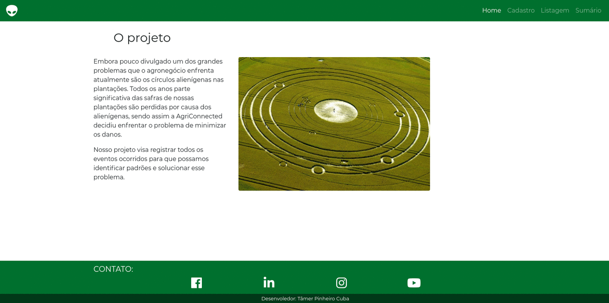

# Agriconnected Aliens

> A versão exata do site que esta rodando no heroku está na branch `deployed-version`

Embora pouco divulgado um dos grandes problemas que o agronegócio enfrenta atualmente são os círculos alienígenas nas plantações. Todos os anos parte significativa das safras de nossas plantações são perdidas por causa dos alienígenas, sendo assim a AgriConnected decidiu enfrentar o problema de minimizar os danos.

Nosso projeto visa registrar todos os eventos ocorridos para que possamos identificar padrões e solucionar esse problema.

## Tecnologias utilizadas
* Python 3.7.0
* Django 2.2
* Bootstrap 4.0
* Jquerry 3.4
* Python Decouple 3.1
* [Gijgo](https://gijgo.com/datepicker/example/bootstrap-4) Bootstrap 4 DatePicker
* Font Awesome icons
* PostgreSQL 9.2
* Git 2.21.0
* Atom 1.36

## Instalação
Esse guia funciona apenas para sistemas operacionais com kernel Linux, se você quiser executá-lo
em outro sistema operacional e compartilhar a experiência aqui fiquei a vontade.

Primeiro você precisa baixar os arquivos para o seu computador, para isso execute o seguinte comando
no diretório desejado
> git clone https://github.com/tamercuba/Agriconnected.git

Caso não tenha em sua maquina, instale o virtualenv (lembrando que estamos utilizando a versão 3.7 do Python, então
    talvez você precise executar `pip3` ao inves de `pip`)
> pip install virtualenv

Crie seu ambiente virtual na pasta que desejar (recomendamos que utilize uma pasta `.venv` dentro da pasta do projeto)
> virtualenv -p /diretorio/do/python3.7/na/sua/maquina ENV_NAME

Após isso navegue até a pasta do projeto (onde está o arquivo `requirements.txt`) e execute
>pip install -r requirements.txt

Instale o PostgreSQL na sua maquina, crie e configure um banco de dados psql. Vá no arquivo `settings.py` e abaixo de `import os` digite: `from decouple import config`, após isso vá até
altere da seguinte maneira a variavel `DATABASES`:

`DATABASES = {
    'default': {
        'ENGINE': 'django.db.backends.postgresql',
        'NAME': config('DB_NAME'),
        'USER': config('DB_USER'),
        'PASSWORD': config('DB_PASSWORD'),
        'HOST': config('DB_HOST'),
        'PORT': config('DB_PORT'),
    }
}`

Após isso crie um arquivo `.env` no diretório root do projeto com as seguintes informações:

`
DB_NAME=nome_do_seu_db
DB_USER=usuario_que_o_django_utilizara_para_acessar_o_db
DB_PASSWORD=pw_do_db
DB_HOST=host_do_db
DB_PORT=porta_do_db
` 

Execute os seguintes comandos para migrar o banco de dados
>./manage.py makemigrations
./manage.py migrate

Agora você precisará criar um super user para fazer o cadastro dos estados e ter acesso ao sistema
>./manage.py createsuperuser

Pronto, você ja pode rodar o site na sua maquina, faça
>./manage.py runserver --insecure

Para acessar o site basta digitar `localhost:8000` no seu navegador.

## Contato
* [LinkedIn](https://linkedin.com/in/tamercuba)
* E-mail: tamercuba@gmail.com
